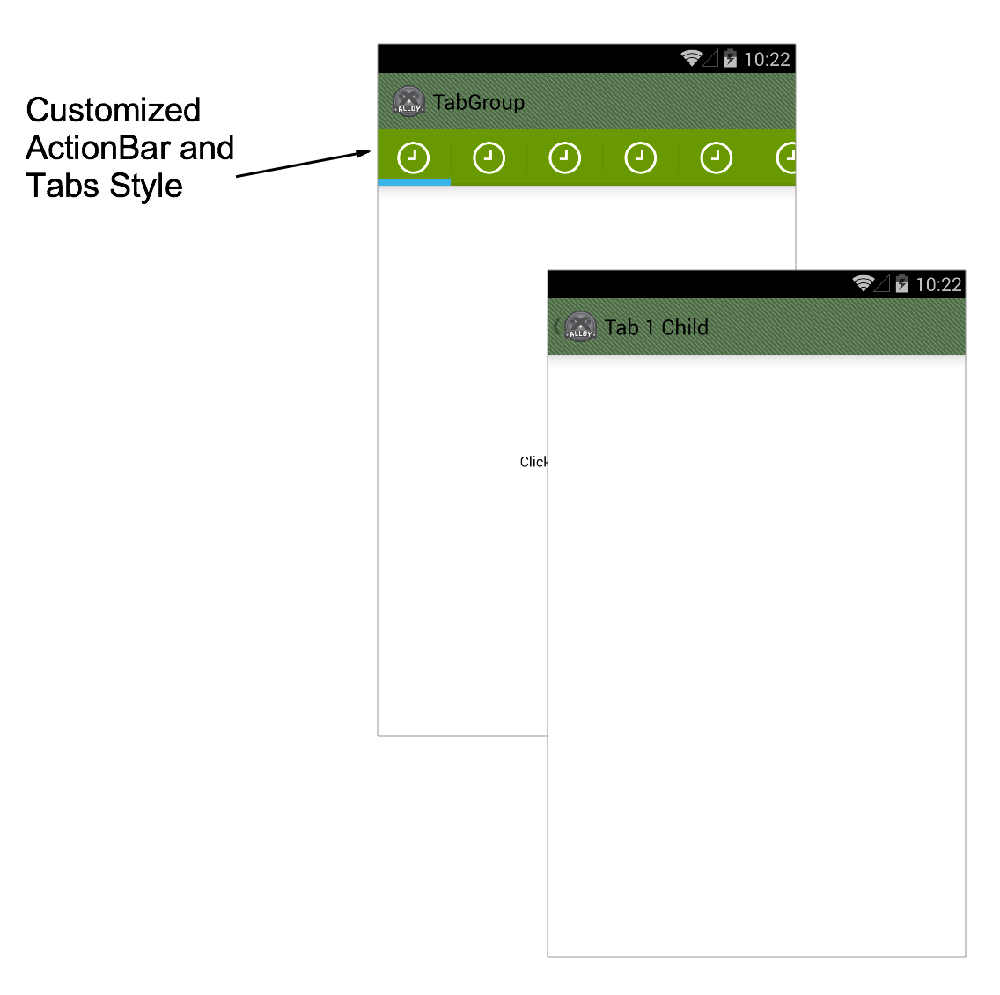

# Template.Tab-based-ActionBar-Style

This Alloy App Template is identical to Template.Tab-based-App.  The only difference is that this one includes a custom ActionBar Style to show how colors can be customized on your Android App.

To create your own custom ActionBar Style, head over to [ActionBar Style Generator](http://jgilfelt.github.io/android-actionbarstylegenerator/#name=example&compat=holo&theme=light&actionbarstyle=solid&texture=0&hairline=0&neutralPressed=1&backColor=E4E4E4%2C100&secondaryColor=D6D6D6%2C100&tabColor=33B5E5%2C100&tertiaryColor=F2F2F2%2C100&accentColor=33B5E5%2C100&cabBackColor=FFFFFF%2C100&cabHighlightColor=33B5E5%2C100) and create one with your desired colors.  Make sure there's no punctuation in the name and that Compatibility is set to "AppCompat".  Download the generated Zip Package and drop it in /platform/android/res.  Then, open [tiapp.xml](tiapp.xml#L42), scroll down to the Android section and specify your theme name like so.

	<application android:theme="@style/Theme.Example"/>

# License

This code is licensed under the Apache Public License (Version 2).